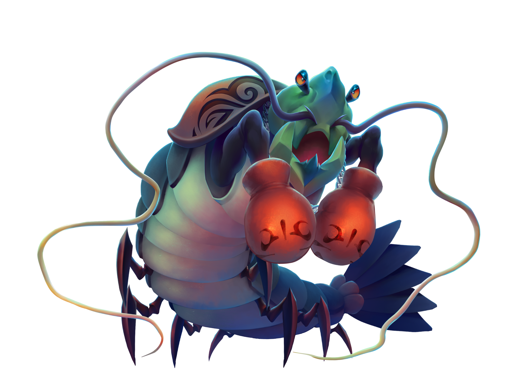

# Sam Romell Portfolio.
Welcome to my portfolio. Here i will show off what kind of projects i've been a part of.
Click the links to find more in depth of what i have done. 

# Games

[ShellScape (8 weeks project)](https://github.com/Spacestarz/Portfolio/tree/main/Shellscape)) << Click here for more info.

 
 |  Shellscape   |        |
|------------|-----------------------------|
| **Engine**   | Unity             |
| **Genre**    | FPS / slasher ?       |
 

Step into the ring in an intense underwater boss fight against Joe Mantis, the Shrimp Champion of the Pacific

* Itch.io [link](https://yrgo-game-creator.itch.io/shellscape)

---

[SnowBlind (8 weeks project)](https://github.com/Spacestarz/Portfolio/tree/main/Snowblind) << Click here for more info.

 |  SnowBlind   |        |
|------------|-----------------------------|
| **Engine**   | Unreal Engine             |
| **Genre**    | Survival / explore     |

Survive a merciless frozen world where the cold can claim you within minutes. One wrong move, losing your way, or neglecting to eat could mean your downfall.

* Itch.io [link](https://yrgo-game-creator.itch.io/snow)

 
