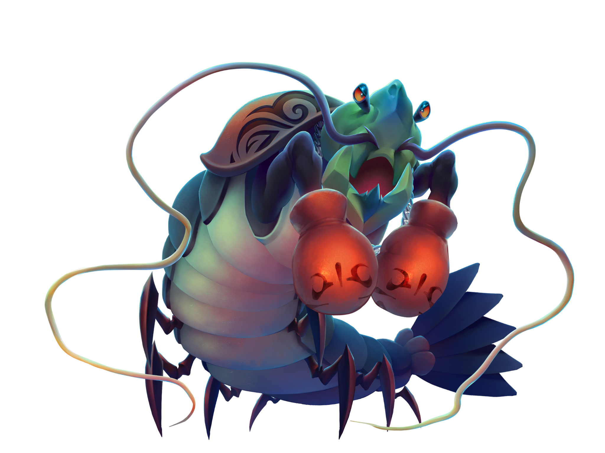

# Sam Romell Portfolio.
Welcome to my portfolio. Here i will show off what kind of projects i've been a part of.

I am a student at yrgo as a Game Creator Programmer. 

Click the links to find more in depth of what i have done. 

# Games

I was the project leader of this project.
- Made so the player was forced to move by adding damaging object on the ground so they need to move.
  
I also took a big role as a supportmanager role by fixing around in scripts and helping the team wherever it was needed.

- More info in the link below 

[ShellScape (8 weeks project)](https://github.com/Spacestarz/Portfolio/tree/main/Shellscape)) << Click here for more info.

 
 |  Shellscape   |        |
|------------|-----------------------------|
| **Engine**   | Unity             |
| **Genre**    | FPS hybrid      |
| **My Role**    |Programmer and team leader      |
 

Step into the ring in an intense underwater boss fight against Joe Mantis, the Shrimp Champion of the Pacific.
Shoot and slash your way to victory!

* Itch.io [link](https://yrgo-game-creator.itch.io/shellscape)

---

- Was responsible of the inventory system.
- Save system so the player can return where they were before(after quitting the game or dying).
- Made so items dropped will be saved so they will be there they got dropped.
- I was also a support to the team by helping whenever it was needed in scripts.  
- More info in the link below 

[SnowBlind (8 weeks project)](https://github.com/Spacestarz/Portfolio/tree/main/Snowblind) << Click here for more info.

 |  SnowBlind   |        |
|------------|-----------------------------|
| **Engine**   | Unreal Engine             |
| **Genre**    | Survival / explore     |
| **My Role**    |Programmer     |

Survive a merciless frozen world where the cold can claim you within minutes. One wrong move, losing your way, or neglecting to eat could mean your downfall.

* Itch.io [link](https://yrgo-game-creator.itch.io/snow)

 

---

- Promt that show up above interactable object also npc’s. It shows the button you need to press to interact with the object / npc.
- Overhauled an existing mechanic in game. Got to change how it worked and fine tuned.
- Made a direction arrow that when the other player is out of sight in view that a arrow show ups that point to which direction the other player is.
- A icon that shows up if the other player is behind a wall.
- Made a "gated" dialog so if the player don't have the desired item they can't click on a dialog option.

- More info in the link below!

- [Project Solar (6 months intership)](https://github.com/Spacestarz/Portfolio/tree/main/Project%20Solar))) << Click here for more info.

-  |  Project Solar   |        |
|------------|-----------------------------|
| **Engine**   | Unreal Engine             |
| **Genre**    | Puzzle, open world, co op    |
| **My Role**    |Programmer     |

 
