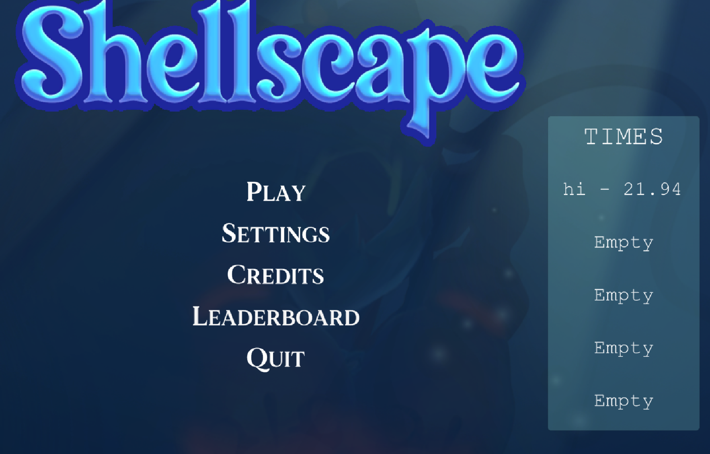

# My contribution to Shellscape

Shellscape is an aquatic themed fps hack n slash hybrid. The objective is to kill the boss, Joe Mantis.
You will need to beware of your surrounding and take down Joe Mantis as fast as possible to get in the high score list. 

I also got the privilege to be the team leader of this project. 

I also had a role as a support in the project and assisting where it was needed.

 Itch.io [link](https://yrgo-game-creator.itch.io/shellscape)

# Sea urchins & Spikes

When we made the boss fight during the playtesting we saw that a lot of playtesters just stood in place and didn't need to move at all when fighting our boss. So we added Sea urchins and spikes that spawn and so the player need to move and also beware of their surrounding while fighting the boss
- I made the sea urchin spawn, the player will take damage and then the sea urchin will disappear. So that it won't be sea urchins over the whole area after awhile.
- Made the spikes spawn from the ground.
  Spikes will spawn in an area around the player and if the player won't move out of the area, a spike will come up from the ground and damage the player. 
<table>
  <tr>
    <td></td>
    <td></td>
  </tr>
</table>

# High Score
When the player starts the game a timer starts and ends when the player has defeated the boss. If the player is in the top 5 they can write their name and it will end up in the high score list in the menu. 

<table>
  <tr>
    <td></td>
    <td></td>
  </tr>
</table>

# Other
---

I also started and made a few attacks for the second boss but we realized that we wouldn't have time to implement it. 
